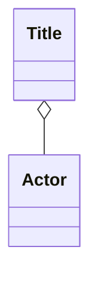
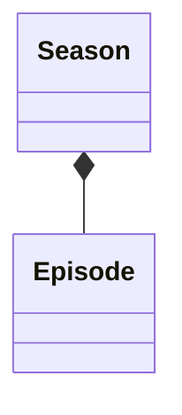
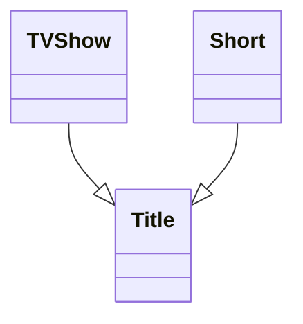

#### Associations, Aggregations and Compositions

- **Association**: There's a relationship between the entities
with at least one entity holding reference to other. They can
exists completely independently of one another.

Example: Teacher and Student

- **Aggregation**: There's more relantionship between the entities
than an association, but they can still exist independetely
of one another. There's an owner of the relationship,but if
the parent is deleted, the child can still remain.

Example: Teacher and Class

- **Composition**: The closest of relationship is reserved
for compositions. There's an owner of the relationship.
However if the parent is deleted, the child must be deleted
too, and makes no sense without its parent relationship.

Example: Class and Grade

- **Inheritance**: 
For example Title is an abstract term deliberately

